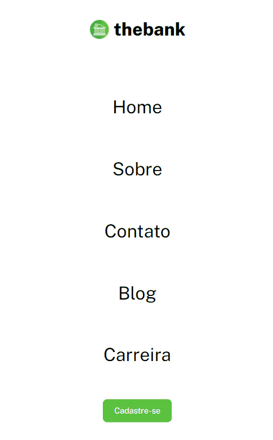

# desafios-devquest-css-avancado
Repositório criado para realização dos desafios do módulo **CSS Avançado** do **Treinamento DevQuest** ministrado pelos Gêmeos e toda sua equipe da **[Dev em Dobro](https://www.instagram.com/devemdobro/)**.

O código em questão apresenta a página inicial da empresa **"thebank"**.

Para estruturar a página foi utilizado HTML5 e CSS3 fazendo uso de **CSS Transitions** para animar os botões e **CSS Flexbox** para responsividade.

Prévia da página em Desktop e Mobile logo abaixo.

