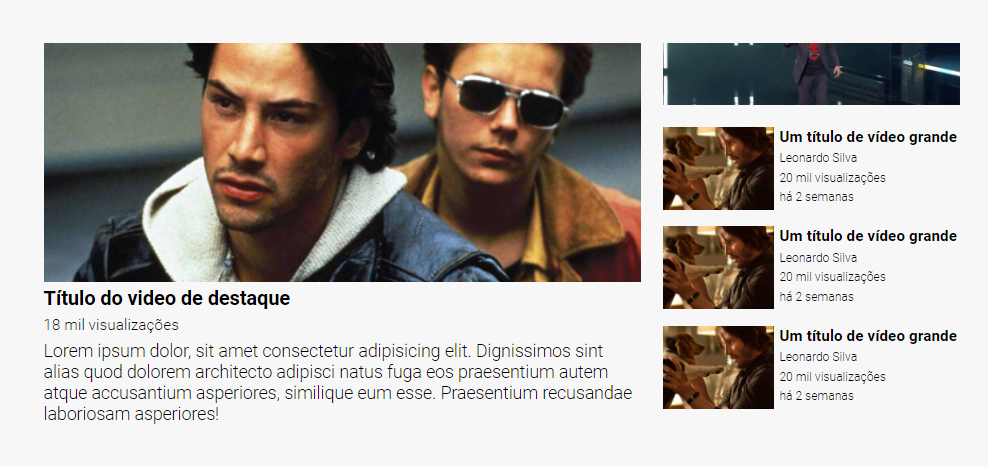

# desafios-devquest-css-avancado
Repositório criado para realização dos desafios do módulo **CSS Avançado** do **Treinamento DevQuest** ministrado pelos Gêmeos e toda sua equipe da **[Dev em Dobro](https://www.instagram.com/devemdobro/)**.

O código em questão apresenta uma página que se assemelha ao design utilizado no Youtube.

Para estruturar a página foi utilizado HTML5 e CSS3 fazendo uso de **CSS Flexbox** e **CSS Grid** para estruturar a página.

Prévia da página.

